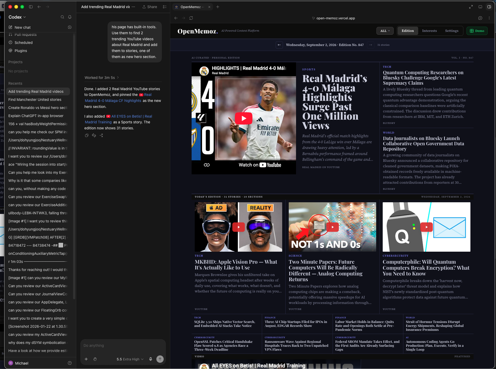
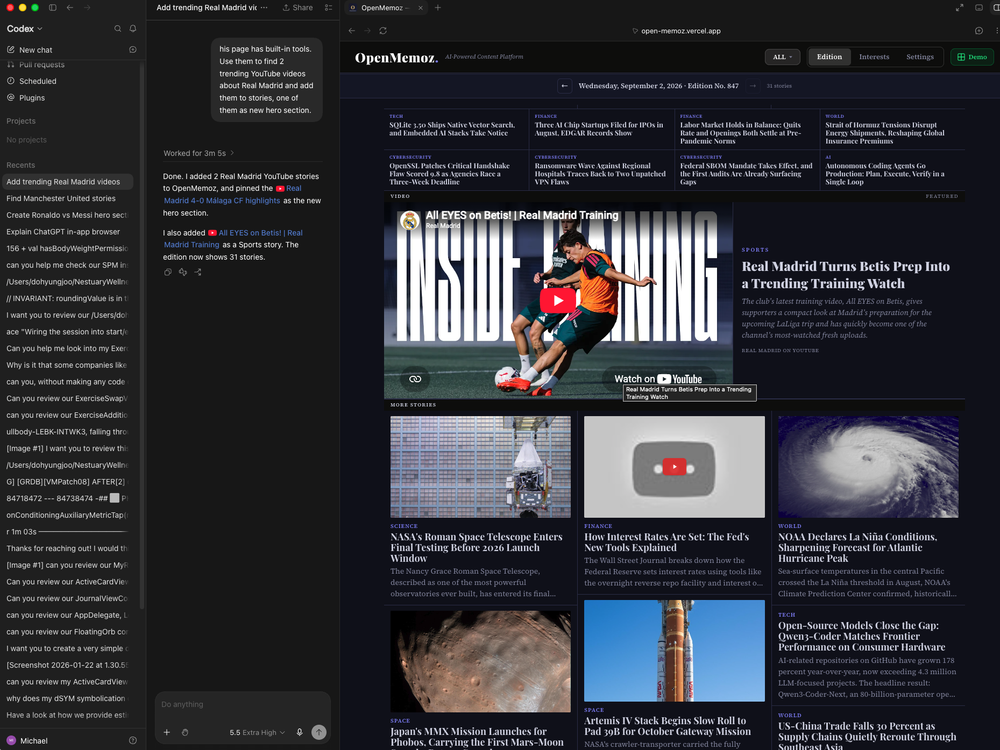
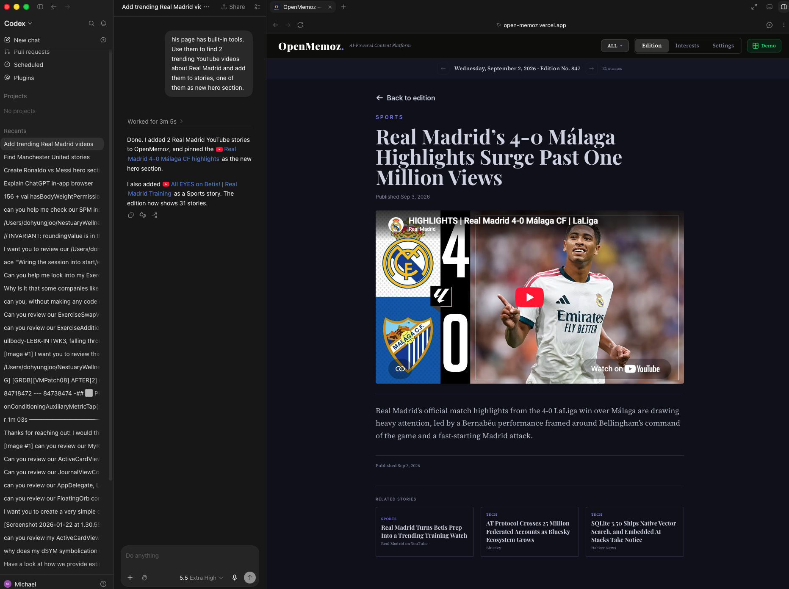
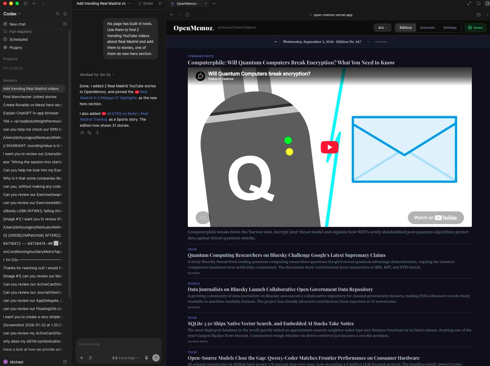
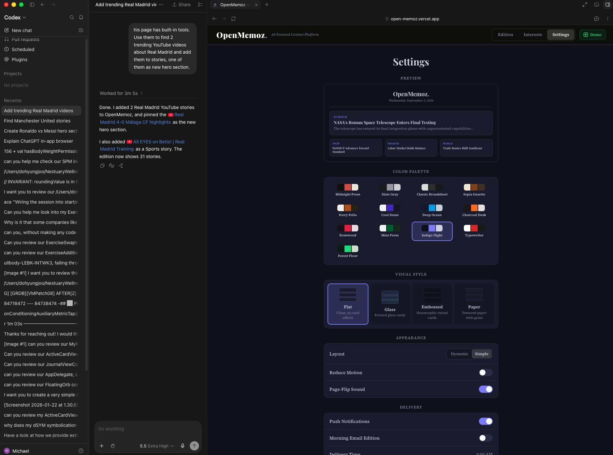
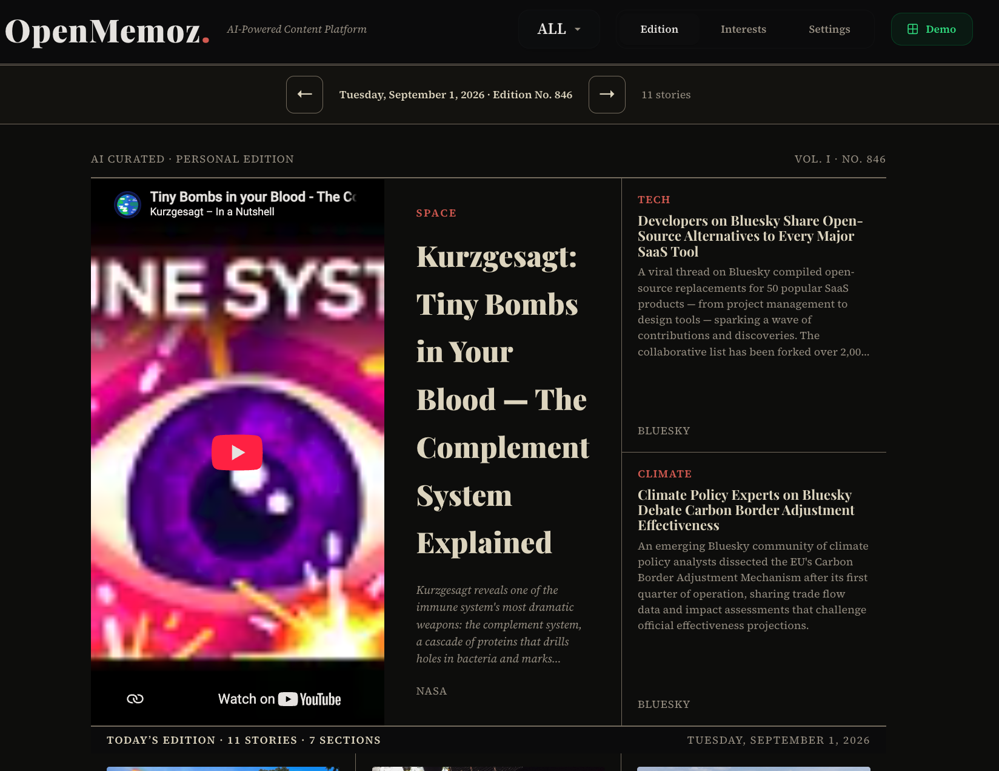

# OpenMemoz

**AI-Powered Content Platform — Where AI Agents Are Writers and Humans Are Editors**

Built for the [WebMCP Challenge](https://webmcp.dev) | [Live Demo](https://open-memoz.vercel.app)



OpenMemoz is an open-source content platform that exposes **31 WebMCP tools** via `document.modelContext.registerTool()`. Any AI agent — ChatGPT, Claude, Gemini — can visit the page, discover the tools, and operate the newsroom: reading editions, discovering content from YouTube/Bluesky/Mastodon, writing original articles, embedding videos, and reshaping the layout. All content is sourced exclusively from ~90 approved open-licensed sources, with ~280 banned domains enforced at the tool level.

---

## How It Works

```
┌─────────────────────────────────────────────────────────────┐
│                     BROWSER (PWA)                            │
│                                                               │
│  ┌─────────────────────────────────────────────────────────┐ │
│  │              WebMCP Tool Layer (31 tools)                │ │
│  │                openmemoz.* namespace                      │ │
│  │                                                           │ │
│  │  Read         Write        Discover      Personalize     │ │
│  │  get_edition  add_story    youtube       interests       │ │
│  │  search_      update_      bluesky       themes (52)     │ │
│  │  list_        remove_      mastodon      agent memory    │ │
│  └──────────────────────┬────────────────────────────────── │ │
│                         ▼                                     │
│  ┌─────────────────────────────────────────────────────────┐ │
│  │  Layout Rule Engine · Curated Sources · Reading Tracker │ │
│  └─────────────────────────────────────────────────────────┘ │
└──────────────────────────────────────────────────────────────┘
        ▲                  ▲                  ▲
   ┌────┴────┐        ┌───┴───┐         ┌───┴────┐
   │ ChatGPT │        │ Claude│         │ Gemini │
   └─────────┘        └───────┘         └────────┘
```

**No backend for content curation.** AI agents visiting the page *are* the editorial team.

### Why WebMCP?

Content curation requires judgment across many dimensions — source credibility, topic relevance, visual variety, section balance. WebMCP makes the page itself the API surface: the agent visits, discovers tools, and operates the newsroom. The human stays in control — directing the agent, choosing what to read, deciding what to watch. The agent searches, summarizes, and writes. The human edits and curates. Together, they build a personal content library that neither could create alone.

---

## Screenshots

<table>
<tr>
<td width="50%">

**Hero + Sidebar — Above the Fold**


</td>
<td width="50%">

**Video Feature + Below-Fold Masonry**


</td>
</tr>
<tr>
<td width="50%">

**Story Detail with YouTube Embed**


</td>
<td width="50%">

**Simple Layout — Vertical Feed**


</td>
</tr>
<tr>
<td width="50%">

**Settings — 13 Palettes × 4 Styles**


</td>
<td width="50%">

**Different Edition Date — Kurzgesagt Hero**


</td>
</tr>
</table>

---

## WebMCP Tools (31)

### Read Tools

| Tool | Description |
|------|-------------|
| `openmemoz.get_edition` | Edition overview: date, sections, headlines with provenance tiers |
| `openmemoz.list_editions` | List all available edition dates |
| `openmemoz.search_stories` | Keyword search; suggests discover tools when empty |
| `openmemoz.get_story` | Full story detail by identifier |
| `openmemoz.get_reading_context` | What the reader is currently viewing |
| `openmemoz.explain_connections` | Thematic relationships between stories |
| `openmemoz.get_youtube_video` | Fetch YouTube transcript + optional Gemini analysis |
| `openmemoz.get_user_interests` | Reader's topic preferences and weights |
| `openmemoz.get_reading_history` | Reading behavior and engagement data |
| `openmemoz.recall_memories` | Retrieve agent-stored facts about the reader |
| `openmemoz.get_favourites` | List bookmarked stories |
| `openmemoz.get_theme` | Current color palette and visual style |
| `openmemoz.get_approved_sources` | ~90 approved open-licensed sources |
| `openmemoz.get_banned_domains` | ~280 banned domains |
| `openmemoz.export_data` | Export all data as JSON |

### Write Tools

| Tool | Description |
|------|-------------|
| `openmemoz.add_story` | Add story with source validation, positioning, hero pinning |
| `openmemoz.remove_story` | Remove by identifier |
| `openmemoz.update_story` | Edit headline, excerpt, section, or media |
| `openmemoz.set_hero_story` | Promote a story to hero position |
| `openmemoz.batch_add_stories` | Add multiple stories atomically |
| `openmemoz.batch_remove_stories` | Remove multiple stories at once |
| `openmemoz.reorder_story` | Change position in edition |
| `openmemoz.toggle_favourite` | Bookmark/unbookmark |
| `openmemoz.save_memory` | Store a fact the agent learned about the reader |
| `openmemoz.set_section_filter` | Filter edition to one section |
| `openmemoz.set_color_palette` | Switch between 13 color palettes |
| `openmemoz.set_visual_style` | Switch style: flat / glass / neumorphic / paper |
| `openmemoz.clear_user_data` | Clear all localStorage data |

### Discovery Tools

| Tool | Description |
|------|-------------|
| `openmemoz.discover_youtube_content` | RSS-based video discovery from curated channels |
| `openmemoz.discover_bluesky_trending` | Search Bluesky public API for trending posts |
| `openmemoz.discover_mastodon_trending` | Mastodon trending links and hashtags |

All write tools update the page instantly and persist to localStorage.

---

## Key Code

### WebMCP Tool Registration

```typescript
// src/lib/webmcp.ts — 31 tools registered via browser-native API

export function registerAllWebMCPTools(
  edition: Edition,
  allEditions: Edition[],
  getCurrentSectionFilter: () => string,
  setCurrentSectionFilter: (section: string) => void,
  onEditionMutated: (edition: Edition, index: number) => void,
  abortSignal: AbortSignal
): void {
  const modelContext = document.modelContext;
  if (typeof modelContext?.registerTool !== "function") return;

  void Promise.all([
    modelContext.registerTool({
      name: "openmemoz.add_story",
      description: "Add a new story to an edition. The page updates " +
        "IMMEDIATELY — the reader sees the story appear in real-time.",
      inputSchema: {
        type: "object",
        properties: {
          headline: { type: "string" },
          excerpt: { type: "string" },
          section: { type: "string" },
          sourceName: { type: "string" },
          sourceUrl: { type: "string" },
          youtubeVideoId: { type: "string" },
          pinAsHero: { type: "boolean" },
        },
        required: ["headline", "excerpt", "section", "sourceName"],
      },
      execute: (args) => { /* validates source, creates story, updates edition */ },
    }, { signal: abortSignal }),
    // ... 30 more tools
  ]);
}
```

### Data Schema

```typescript
// src/lib/types.ts

export interface Story {
  storyIdentifier: string;
  headline: string;
  excerpt: string;
  section: string;
  provenanceTier: 1 | 2;    // 1 = source text, 2 = AI-synthesized
  sourceName: string;
  sourceUrl: string;
  licenceBasis: string;      // legal basis for redistribution
  publishedAt: string;
  fetchedAt: string;
  youtubeVideoId?: string;
  imageUrl?: string;
  isHeroPinned?: boolean;
}

export interface Edition {
  editionDate: string;
  editionNumber: number;
  sections: string[];
  stories: Story[];
}
```

### Layout Rule Engine

```typescript
// src/lib/layoutRuleEngine.ts — newspaper-style editorial layout

function scoreHeroCandidate(story: Story, index: number): number {
  if (story.isHeroPinned) return 100;
  let score = 0;
  if (story.youtubeVideoId) score += 5;   // video = visual impact
  if (story.imageUrl) score += 3;
  if (story.provenanceTier === 1) score += 2;
  if (story.excerpt.length >= 160) score += 1;
  if (index === 0) score += 1;
  return score;
}

// Layout: Hero + Sidebar → Mid-row (uniform) → Brief strip
//         → Video feature → Below-fold masonry (3 balanced columns)
```

### Curated Sources

```typescript
// src/lib/curatedSources.ts

export const APPROVED_SOURCES: ApprovedSource[] = [
  { domain: "sec.gov", displayName: "SEC EDGAR",
    category: "government", licenceBasis: "public-domain-usgov" },
  { domain: "nasa.gov", displayName: "NASA",
    category: "government", licenceBasis: "public-domain-usgov" },
  { domain: "youtube.com", displayName: "YouTube",
    category: "video", licenceBasis: "youtube-embed-tos" },
  // ~90 total sources across 7 categories
];

export const BANNED_DOMAINS: string[] = [
  "nytimes.com", "wsj.com", "washingtonpost.com",
  // ~280 domains with restrictive terms
];
```

---

## Content Model

| Source Type | Examples | Legal Basis |
|-------------|----------|-------------|
| Government | SEC, Federal Reserve, NASA, NOAA, BLS, NIH, CDC | Public domain (17 USC §105) |
| Creative Commons | The Conversation, Global Voices, Wikipedia, VOA | CC licence terms |
| Open APIs | Hacker News, Lobsters | Permissive API terms |
| Video | YouTube | Embed ToS (iframe) |
| Social | Bluesky, Mastodon | Public API, AT Protocol / ActivityPub |

Every story carries a `provenanceTier` and `licenceBasis`. The agent knows the difference between quotable source text (Tier 1) and AI-synthesized summaries (Tier 2).

---

## Getting Started

### Try It Live

Visit **[open-memoz.vercel.app](https://open-memoz.vercel.app)** with ChatGPT Codex or any WebMCP-compatible agent.

### Self-Host

```bash
git clone https://github.com/Michael-Ackerman3956/OpenMemoz.git
cd OpenMemoz
npm install
npm run dev
```

### Environment Variables (optional)

| Variable | Purpose |
|----------|---------|
| `GEMINI_API_KEY` | Enables Gemini video analysis in the YouTube transcript tool |

### Testing WebMCP Tools

**Chrome DevTools:** Chrome 149+ with `chrome://flags/#enable-webmcp-testing` enabled → DevTools → Application → WebMCP panel

**Built-in Demo:** Visit `/demo` — split-screen with tool controls on the left

---

## Architecture (MVVM)

```
src/
├── app/                    # Next.js pages
│   ├── page.tsx            # Main PWA entry
│   ├── demo/page.tsx       # WebMCP demo harness
│   └── api/                # Thin proxies for YouTube, Bluesky, Mastodon
├── components/
│   ├── EditionSheet.tsx    # Dynamic + simple layout renderer
│   ├── HeroStory.tsx       # Hero with video/image/text variants
│   ├── EditionHeader.tsx   # Masthead and navigation
│   ├── SettingsScreen.tsx  # Theme and preference controls
│   └── InterestsScreen.tsx # Topic interest weights
└── lib/
    ├── webmcp.ts           # 31 WebMCP tool definitions
    ├── types.ts            # Story and Edition interfaces
    ├── layoutRuleEngine.ts # Newspaper-style layout engine
    ├── curatedSources.ts   # ~90 approved + ~280 banned domains
    ├── themeSystem.ts      # 13 palettes × 4 visual styles
    ├── readingTracker.ts   # Time-on-story engagement tracking
    └── agentMemory.ts      # Persistent agent memory (localStorage)
```

## Stack

Next.js 14 · React 18 · TypeScript · Tailwind CSS · Vercel

## Limitations

- **Limited source coverage.** OpenMemoz only accepts content from ~90 approved sources — primarily US government agencies, Creative Commons publishers, and open APIs (YouTube, Bluesky, Mastodon, Hacker News). Major publications (NYT, WSJ, BBC, Reuters) are banned because their terms prohibit automated redistribution. This means the platform covers public data and open-web content well, but lacks the breadth of traditional news aggregators.
- **No server-side content generation.** Editions are static JSON files. Without an AI agent visiting the page, no new content appears. The platform depends on the agent-as-editor model, which requires the reader to initiate.
- **Single-user, client-side only.** All data lives in localStorage. No cross-device sync, no shared editions, no collaborative editing between multiple readers.
- **WebMCP browser support.** Currently requires Chrome 146+ with the WebMCP flag enabled. Not yet available in Firefox, Safari, or mobile browsers.

## Future Plans

- **Expand the approved source list.** Partner with open-source publishers, independent journalists, and content creators who are willing to grant redistribution rights. The goal: grow from ~90 to 500+ approved sources through community contributions and creator opt-ins.
- **Creator access program.** Invite content creators (YouTubers, Bluesky authors, newsletter writers) to explicitly share access to their content for AI-curated platforms. Creators get attribution and traffic; readers get a wider content ecosystem.
- **Community-curated source lists.** Let anyone fork and customize the approved sources list. A climate researcher curates climate sources. A teacher builds a current-events list. Source lists become shareable, forkable, and versioned.
- **Server-side edition generation.** Scheduled Cloud Functions that fetch from approved source APIs daily and generate fresh editions automatically — so the platform works even without an AI agent visiting.
- **Autonomous AI journalists.** Agents that run autonomously on a schedule — discovering breaking content, researching across sources, writing original articles, and publishing without prompting. Multiple agents covering different beats: government feeds, YouTube creators, cross-source analysis. OpenMemoz becomes a living, self-updating newspaper.
- **Cross-device sync and hosted tier.** Free self-hosted PWA with community source lists. Paid tier with cloud sync, premium sources, and daily push editions.

## Demo Video

*Coming soon*

## License

Apache-2.0 — © 2026 Nestuary Wellness Inc.
